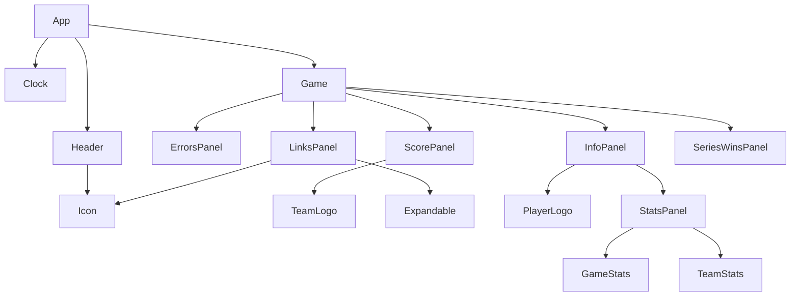

# Components

The application uses a hierarchical structure where the `App` component acts as the root. Below is a visualization and a detailed breakdown of how components are nested and utilized.

## Visualization

## Component Breakdown

### Root Level
- **[app.ts](./app.ts)**: The entry point of the UI. It manages the overall state and coordinates between the `Clock`, `Header`, and multiple `Game` instances.

### Main Infrastructure
- **[clock.ts](./clock.ts)**: Manages the simulation time and emits events for game updates (goals, period changes, etc.).
- **[header.ts](./header.ts)**: Top bar of the application, featuring the `Clock` state and playback controls.

### Game-Specific Components
- **[game.ts](./game.ts)**: A container for all information related to a single NHL game.
    - **[score-panel.ts](./score-panel.ts)**: Displays the current score and team logos.
        - **[team-logo.ts](./team-logo.ts)**: Helper to render SVG team logos.
    - **[info-panel](./info-panel/info-panel.ts)**: Shows detailed game stats and player information (e.g., goal scorers).
        - **[stats-panel](./info-panel/stats-panel/stats-panel.ts)**: Inner panel for team and game statistics.
    - **[links-panel.ts](./links-panel.ts)**: Provides links to external resources (e.g., game recap videos).
    - **[series-wins-panel.ts](./series-wins-panel.ts)**: (Optional) Displays playoff series standing.
    - **[errors-panel.ts](./errors-panel.ts)**: Displays any errors encountered for a specific game.

### Shared / UI Components
- **[icon](./icon/icon.ts)**: A shared component for rendering SVG icons.
- **[expandable.ts](./expandable.ts)**: A wrapper component that handles show/hide animations for panels like `LinksPanel`.
